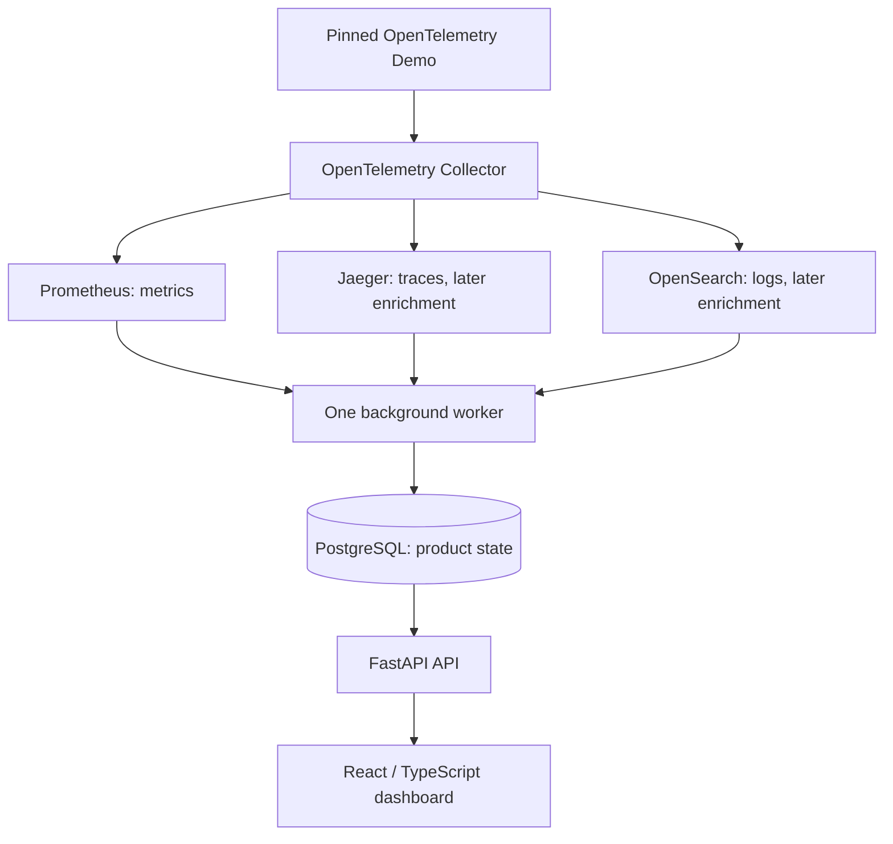

# Rook

**Real-Time Incident Intelligence for Distributed Systems**

Rook is a cloud-native reliability platform that monitors distributed applications, detects operational incidents, correlates failures with recent system changes, and helps engineers understand what went wrong.

> Rook is currently under active development. The repository is being built incrementally from architecture through production deployment.

## The Problem

Modern applications generate information across many separate systems:

- Metrics show that something is unhealthy.
- Logs contain error details.
- Traces show where a request failed.
- Kubernetes records infrastructure changes.
- Deployment systems record newly released versions.

Engineers often have to search across all of these systems during an incident. Rook brings the evidence together into one operational control room.

## What Rook Will Do

Rook will provide:

- Live service-health monitoring
- Request, latency, throughput, and error-rate visibility
- Incident detection based on reliability thresholds
- Kubernetes and deployment-event tracking
- Correlation between failures and recent deployments
- Incident timelines with supporting evidence
- Optional AI-assisted incident explanations
- Canary-release and rollback demonstrations

## Real Telemetry Requirement

Rook will not display invented dashboard values or use a fabricated monitoring dataset.

Its operational data will come from real running software through:

- OpenTelemetry instrumentation
- Prometheus metrics
- Application logs and distributed traces
- Kubernetes events
- Deployment events
- Real HTTP requests and container resource usage

Automated traffic generation and controlled failure experiments may be used, but Rook must observe the resulting real system behavior.

## Planned Architecture

This accepted V1 architecture is planned, not implemented. One FastAPI API process and one background-worker process will share Python backend modules and may initially use the same container image. Ingestion and incident detection will be modules, not separate network services.



Arrows show telemetry and product-data flow. The API will also query the same Prometheus instance for bounded chart data. PostgreSQL will store incidents, evidence references, observed changes, rule configuration, and worker checkpoints; it must not duplicate raw metrics, logs, or traces.

The first implementation slice will be metrics-only. Logs and traces will enrich evidence later, followed by Kubernetes events and deployment observations during local Kubernetes development. Missing telemetry will be unknown, stale, or insufficient evidence, never automatically healthy. Deployment correlation will indicate temporal evidence, not proof of causation.

A pinned OpenTelemetry Demo release will be the external workload, using the Demo's current load generator for real traffic and controlled failure testing. Rook itself will be designed and implemented independently. Optional AI analysis will be disabled by default and may summarize evidence, but cannot determine incident state.

Development will progress from Docker Compose to local kind Kubernetes and Helm, then Argo CD, and finally temporary Terraform-provisioned GKE. V1 acceptance will require demonstrating canary deployment and safe operator-led rollback through a Git desired-state change. Automated rollback using Prometheus analysis and Argo Rollouts will remain a later enhancement.

## Planned Technology Stack

| Area | Technologies |
|---|---|
| Backend | Shared Python modules; one FastAPI API process and one background worker |
| Frontend | React, TypeScript |
| Product State | PostgreSQL; no raw telemetry duplication |
| Telemetry Stores | Prometheus (metrics), Jaeger (traces), OpenSearch (logs) |
| Collection and Exploration | OpenTelemetry Collector, Grafana |
| Containers | Docker, Docker Compose for local development |
| Orchestration | Local kind Kubernetes, Helm |
| Infrastructure | Terraform, temporary Google Kubernetes Engine deployment |
| CI/CD | GitHub Actions, Argo CD |
| Testing | pytest, Vitest, Playwright, k6 |
| Security | Secret Manager, Trivy, Dependabot |

The table describes planned technologies to be introduced progressively. Redis, Kafka, and Celery are not required and are excluded from Rook V1 unless measured requirements later justify a new decision. Demo workload dependencies remain separate from Rook's control plane.

## Repository Structure

```text
.github/workflows/       CI/CD workflows
apps/api/                FastAPI control-plane API
apps/frontend/           React operations dashboard
services/                Telemetry and incident-processing services
packages/contracts/      Shared schemas and event contracts
docs/                    Architecture, decisions, and runbooks
infra/terraform/         Cloud infrastructure
deploy/helm/             Kubernetes deployment packages
observability/           Monitoring and dashboard configuration
tests/                   Integration and end-to-end tests
scripts/                 Development and operations utilities
```

## Development Roadmap

- [x] Project definition and repository foundation
- [ ] Architecture and event-contract design
- [ ] FastAPI control-plane API
- [ ] PostgreSQL persistence
- [ ] React operations dashboard
- [ ] Live telemetry integration
- [ ] Incident detection and correlation
- [ ] Automated testing
- [ ] Docker and local Kubernetes
- [ ] CI/CD and GitOps
- [ ] Observability dashboards
- [ ] GKE infrastructure
- [ ] Canary deployment and rollback
- [ ] Controlled failure demonstration
- [ ] Final documentation and demo

## Documentation

- [Project Charter](docs/PROJECT_CHARTER.md)
- [Architecture Overview](docs/architecture/README.md)
- [System Context](docs/architecture/system-context.md)
- [Container View](docs/architecture/container-view.md)
- [Telemetry and Incident Flow](docs/architecture/telemetry-and-incident-flow.md)
- [Deployment Evolution](docs/architecture/deployment-evolution.md)
- [ADR-0001: Modular Backend, API and Worker](docs/adr/0001-modular-backend-api-and-worker.md)
- [ADR-0002: Real Telemetry and Demo Workload](docs/adr/0002-real-telemetry-and-demo-workload.md)
- [ADR-0003: Telemetry Storage and Product State](docs/adr/0003-telemetry-storage-and-product-state.md)
- [ADR-0004: Local-First Deployment](docs/adr/0004-local-first-deployment.md)
- Operational runbooks will be maintained under `docs/runbooks/`.

## License

This project is licensed under the MIT License.