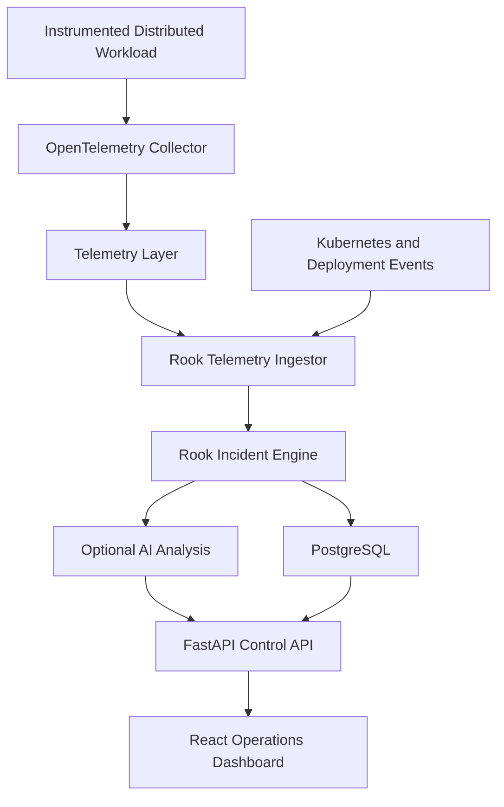

# Rook

**Real-Time Incident Intelligence for Distributed Systems**

Rook is a cloud-native reliability platform that monitors distributed applications, detects operational incidents, correlates failures with recent system changes, and helps engineers understand what went wrong.

> Rook is currently under active development. The repository is being built incrementally from architecture through production deployment.

## The Problem

Modern applications generate information across many separate systems:

- Metrics show that something is unhealthy.
- Logs contain error details.
- Traces show where a request failed.
- Kubernetes records infrastructure changes.
- Deployment systems record newly released versions.

Engineers often have to search across all of these systems during an incident. Rook brings the evidence together into one operational control room.

## What Rook Will Do

Rook will provide:

- Live service-health monitoring
- Request, latency, throughput, and error-rate visibility
- Incident detection based on reliability thresholds
- Kubernetes and deployment-event tracking
- Correlation between failures and recent deployments
- Incident timelines with supporting evidence
- Optional AI-assisted incident explanations
- Canary-release and rollback demonstrations

## Real Telemetry Requirement

Rook will not display invented dashboard values or use a fabricated monitoring dataset.

Its operational data will come from real running software through:

- OpenTelemetry instrumentation
- Prometheus metrics
- Application logs and distributed traces
- Kubernetes events
- Deployment events
- Real HTTP requests and container resource usage

Automated traffic generation and controlled failure experiments may be used, but Rook must observe the resulting real system behavior.

## Planned Architecture



The OpenTelemetry Demo will be used as a representative external workload for live telemetry and controlled failure testing. Rook itself will be designed and implemented independently.

## Planned Technology Stack

| Area | Technologies |
|---|---|
| Backend | Python, FastAPI |
| Frontend | React, TypeScript |
| Data | PostgreSQL, Redis |
| Event Processing | Kafka where event-driven processing is justified |
| Telemetry | OpenTelemetry, Prometheus, Grafana |
| Containers | Docker |
| Orchestration | Kubernetes, Helm |
| Infrastructure | Terraform, Google Kubernetes Engine |
| CI/CD | GitHub Actions, Argo CD |
| Testing | pytest, Vitest, Playwright, k6 |
| Security | Secret Manager, Trivy, Dependabot |

## Repository Structure

```text
.github/workflows/       CI/CD workflows
apps/api/                FastAPI control-plane API
apps/frontend/           React operations dashboard
services/                Telemetry and incident-processing services
packages/contracts/      Shared schemas and event contracts
docs/                    Architecture, decisions, and runbooks
infra/terraform/         Cloud infrastructure
deploy/helm/             Kubernetes deployment packages
observability/           Monitoring and dashboard configuration
tests/                   Integration and end-to-end tests
scripts/                 Development and operations utilities
```

## Development Roadmap

- [x] Project definition and repository foundation
- [ ] Architecture and event-contract design
- [ ] FastAPI control-plane API
- [ ] PostgreSQL persistence
- [ ] React operations dashboard
- [ ] Live telemetry integration
- [ ] Incident detection and correlation
- [ ] Automated testing
- [ ] Docker and local Kubernetes
- [ ] CI/CD and GitOps
- [ ] Observability dashboards
- [ ] GKE infrastructure
- [ ] Canary deployment and rollback
- [ ] Controlled failure demonstration
- [ ] Final documentation and demo

## Documentation

- [Project Charter](docs/PROJECT_CHARTER.md)
- Architecture documents will be added under `docs/architecture/`.
- Architecture Decision Records will be maintained under `docs/adr/`.
- Operational runbooks will be maintained under `docs/runbooks/`.

## License

This project is licensed under the MIT License.