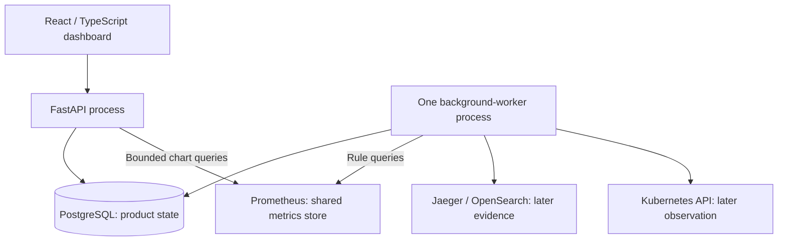

# Container view

Status: planned runtime boundaries. No component implementation is asserted here.

The backend will be one modular Python application run as one FastAPI process and one background-worker process. Both will import shared Python modules and may initially use the same container image with different entry points.

Arrows represent calls or writes. Telemetry collection is shown separately in the [flow view](telemetry-and-incident-flow.md).

## Responsibilities

| Component | Planned responsibility and limit |
|---|---|
| React dashboard | Service measurements, freshness, incidents, timelines, and evidence links. Use HTTP polling initially; do not infer healthy values in the browser. |
| FastAPI process | Product API, bounded metric queries, and explicit operator actions such as acknowledgment. Do not run the continuous detector in API request handlers. |
| Background worker | Schedule metric evaluation, ingest observed changes, correlate evidence, and persist incident transitions and checkpoints. |
| Shared ingestion module | Backend adapters, identity normalization, source timestamps, evidence references, and Kubernetes observation. No separate network deployment. |
| Shared incident module | Deterministic rules, deduplication, violation/recovery state, and temporal correlation. Independently testable. |
| PostgreSQL | Incidents, timelines, evidence references, observed changes, rule configuration, and worker checkpoints. Never duplicate raw metrics, logs, or traces. |
| Collector and telemetry backends | Collect and store raw signals outside product storage. Reuse the Demo integration where practical. |
| Grafana | Detailed telemetry exploration; not the owner of Rook incident state. |
| Optional AI adapter | Disabled-by-default evidence summaries, clearly advisory and outside the incident-state decision path. No separate AI service required. |

The worker will start as a singleton. A PostgreSQL ownership lock, transactional state changes, and uniqueness constraints will guard against overlapping execution and duplicate active incidents. Checkpoints will support restart recovery. Scaling will require evidence of a bottleneck and a revised concurrency design.

Kafka, Redis, and Celery are excluded from V1. PostgreSQL and bounded periodic work are sufficient for the initial product-state workload; no distributed task system is planned.

## Planned repository mapping

| Folder | Intended contents |
|---|---|
| `apps/api` | FastAPI composition, worker entry point, and database migrations. |
| `apps/frontend` | React/TypeScript incident and service views. |
| `services/telemetry-ingestor` | Shared importable Python ingestion package, not a standalone service initially. |
| `services/incident-engine` | Shared importable Python detection and correlation package. |
| `packages/contracts` | Versioned event schemas and API contracts. |
| `observability` | Collector, Prometheus, Grafana, and telemetry-backend settings. |
| `deploy/helm` | Rook packaging and environment-specific values for pinned dependencies. |
| `infra/terraform` | Temporary GKE infrastructure and scoped cloud identities. |
| `.github/workflows` | Future GitHub Actions checks and image builds. |
| `tests` | Meaningful rule, persistence, integration, and real-workload acceptance tests. |
| `scripts` | Future local lifecycle, controlled failure, and demonstration utilities. |
| `docs` | Architecture, ADRs, and future operational runbooks. |

These are placement decisions, not claims that those files or capabilities exist. Runtime boundaries will follow operational need rather than folder names.
