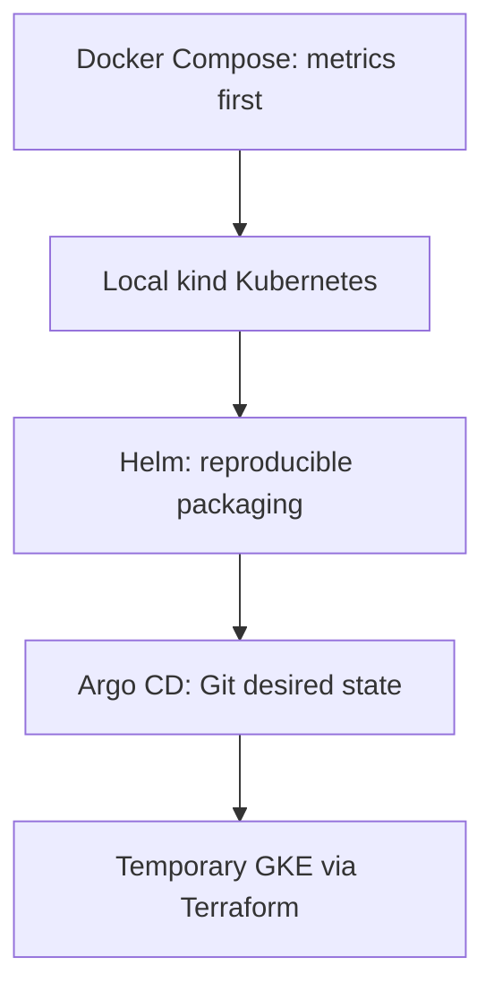

# Deployment evolution

Status: approved progression; all deployment stages below are planned, not completed.

## Stages and exit criteria

| Stage | Planned scope | Evidence needed before advancing |
|---|---|---|
| Docker Compose | Pinned Demo, Collector, Prometheus, PostgreSQL, API, worker, React, and Grafana. Introduce Jaeger/OpenSearch evidence enrichment progressively. | Real metrics drive detection and recovery; restarts preserve product state; missing data remains explicit. |
| Local kind Kubernetes | Move the exercised workload and Rook into a local cluster; introduce Kubernetes events and rollout observations. | A real rollout failure is observed and correctly associated with its service; collection gaps are visible. |
| Helm | Capture repeatable local deployments with pinned versions and environment values. | Repeated installation reproduces behavior without manual configuration drift. |
| Argo CD | Reconcile Git desired state; demonstrate canary deployment and safe operator-led rollback by changing Git. | Real traffic exercises the canary; desired-state reversal produces an observed rollout and measured recovery without reconciliation undoing it. |
| Temporary GKE | Use Terraform for approved cloud infrastructure and Helm/Argo CD for workloads. | Repeat the locally verified canary and safe rollback demonstration, export required results, and execute the agreed teardown. |

Helm packaging may begin alongside local kind work; Argo CD should follow a working repeatable Helm deployment. GitHub Actions will later run relevant tests, build immutable images, and support reviewed desired-state updates. It will not be a second competing workload reconciler.

## Cost and portability

Development will use local compute and avoid recurring cloud resources. Measure the pinned Demo and Rook's CPU, memory, and disk requirements before selecting cloud capacity. Near-zero cloud cost does not imply negligible laptop resource use.

Reuse images and charts across environments, changing configuration such as storage, resource budgets, and endpoints. Start with localhost or port-forwarded access rather than public ingress. Bound raw telemetry retention in each backend. PostgreSQL will use persistent storage, but a single-instance demonstration will not claim high availability.

Temporary GKE will require an agreed project, region, budget, runtime window, retention/export policy, and teardown owner. Teardown must account for persistent disks and other chargeable resources as well as the cluster. No cloud provisioning is authorized merely by this document.

## Rollback and later automation

The initial rollback will be operator-led through a Git desired-state change to the previously accepted version or configuration. Argo CD will reconcile that change once introduced. Earlier local stages may apply the reviewed Git state manually. Rook will observe rollout progress and subsequent telemetry; rollback intent or command completion will not establish recovery.

Demonstrating canary deployment and safe rollback is a required V1 acceptance criterion. The implementation mechanism remains flexible: separate stable and canary Deployments for a selected Demo service are one option, with approximate traffic distribution and real per-version measurements. The exercise must verify that real traffic reaches the canary, observe the failure, and confirm recovery after operator-led rollback. Exact traffic weighting is not a V1 guarantee.

Automated rollback using Prometheus analysis and Argo Rollouts is a later enhancement requiring separate design and authorization. Argo Rollouts is not an initial dependency, and Argo CD alone is not the proposed automated analysis engine. Rook's observer credentials will not need workload mutation privileges for the initial workflow.

## Operational preparation

Before a cloud demonstration, plan scoped identities, secret handling outside Git, restore/export procedures, bounded resource use, and tests of telemetry failure and worker restart. Optional AI will remain disabled unless its provider, cost, and permitted evidence are approved. Public access and production durability require later decisions.
