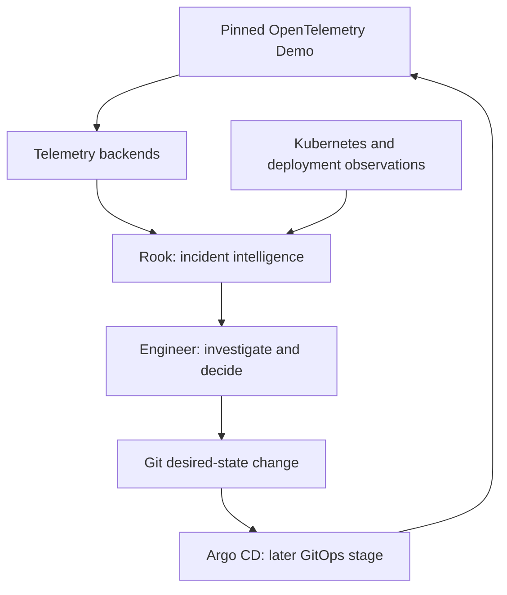

# System context

Status: planned V1 architecture, not a description of implemented functionality.

Rook will serve Site Reliability Engineers, Platform Engineers, DevOps Engineers, and Software Engineers operating distributed applications. It will consolidate incident evidence while retaining specialized telemetry systems for detailed exploration.

## External systems and boundaries

| System or actor | Planned relationship with Rook |
|---|---|
| OpenTelemetry Demo | External monitored workload, pinned to a selected release; not a Rook-owned business application. |
| Demo load generator | Use the Demo's current load generator as supplied by the pinned release to issue real requests. |
| OpenTelemetry Collector | Collect and route actual signals; Rook will not implement a replacement OTLP collector. |
| Prometheus, Jaeger, OpenSearch | Own metrics, traces, and logs respectively; Rook will query them for measurements and evidence. |
| Grafana | Provide detailed telemetry exploration alongside Rook's incident workflow. |
| Kubernetes API | Supply events, resource identity, and observed rollout state once Kubernetes is introduced. |
| Git and Argo CD | Express and reconcile desired state; an operator will initiate rollback through a Git change. |
| Optional AI provider | Receive only permitted evidence when explicitly enabled; return advisory summaries. |

The Demo's own dependencies are part of the external workload. Their presence does not justify adding Kafka, Redis, or Celery to Rook's control plane. Disable optional workload components only when the selected exercise and its real request path remain valid.

## Data integrity and access

Generated load and intentional failures are permitted because the resulting observations come from running software. Rook must not replace unavailable signals with fabricated records or a healthy default. Deployment proximity is supporting temporal evidence, not a causal verdict.

Initially, access will be local or through Kubernetes port-forwarding. Telemetry stores and PostgreSQL will not be directly exposed to the public internet. Kubernetes observation will use narrowly scoped read permissions. Rook's normal runtime will not need cluster mutation privileges for rollback.

Credentials will remain outside committed documentation and configuration. External AI access will be disabled by default; enablement will require a provider and evidence-handling decision. Telemetry text will be treated as untrusted input, and AI output will never control incident transitions or execute remediation.

## Demonstration boundary

V1 will target a single demonstration environment with bounded retention and no high-availability promise. It will not implement enterprise billing, multi-tenancy, arbitrary production-cluster mutation, or a replacement for full observability platforms.
