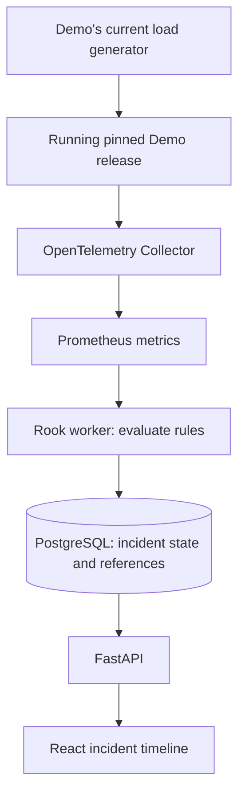

# Telemetry and incident flow

Status: planned behavior. The first implementation slice will use metrics only.

## Progressive signal support

| Stage | Signal and handling |
|---|---|
| First slice | Query real request volume, errors, and latency in Prometheus. Validate available instruments and labels for the pinned Demo before defining queries. |
| Evidence enrichment | Route traces to Jaeger and logs to OpenSearch. Query by service, time range, and trace identity where available; attach references to incidents. |
| Local Kubernetes | Observe Kubernetes events and rollout/resource state. Add real container resource measurements through configured telemetry collection. |
| Deployment correlation | Relate observed revisions, images, rollout outcomes, and timestamps to affected services. A desired-state change alone does not establish deployment success. |

The Collector will route signals to their dedicated stores; the worker will query those stores rather than receive every raw signal. The selected Demo's current load generator will supply real HTTP traffic. Neither dashboards nor acceptance demonstrations may rely on invented monitoring data or hard-coded incidents.

## Detection and lifecycle

1. Identify services by environment, namespace where applicable, and service name; retain workload and version identity when actually available.
2. Evaluate versioned rules against bounded Prometheus query windows. Configuration will specify thresholds, minimum request counts, evaluation cadence, violation duration, and recovery duration.
3. Open an incident only after observed data satisfies a sustained violation rule. Deduplicate active incidents by service and rule using database constraints.
4. Persist transitions, rule identity, evaluation window, and evidence references transactionally. Retain worker checkpoints for restart recovery.
5. Add later log, trace, Kubernetes, and deployment references without making their availability a prerequisite for metrics-based detection.
6. Resolve only after sufficient fresh observations satisfy recovery criteria. Operator acknowledgment is separate from measured recovery.

Missing data will be represented as unknown, stale, or insufficient evidence. Empty results are not zero errors; no traffic is not proof of health. A telemetry outage must not resolve an active incident. UI values will include observation time and freshness, and never fall back to an invented healthy value.

## Evidence and correlation

References will identify the source backend, service, time window, and query or trace/event identifier. PostgreSQL will store product state and these references, not copies of raw metrics, log records, or trace spans. Backend retention can therefore make historical evidence unavailable; the UI must identify that limitation without reconstructing missing evidence.

Store source time separately from ingestion time. Kubernetes observations will distinguish attempted, progressing, successful, and failed rollouts based on observed state. Reconnect/relist behavior will expose gaps when historical events cannot be recovered.

An incident may show that a matching service changed shortly before its failure. This is temporal evidence, not proof of causation. Do not substitute a confidence label or AI explanation for causal verification.

Optional AI will be disabled by default and may summarize available evidence with source references. Timeouts or unavailable analysis will not affect detection or recovery. AI cannot determine incident state or perform rollback.

## Failure handling to validate

| Scenario | Required planned behavior |
|---|---|
| Collector/backend outage | Mark collection or evidence unavailable; preserve incident state and expose freshness. |
| Low traffic or missing series | Report insufficient evidence; do not invent zeros or health. |
| Flapping errors | Use sustained violation and recovery windows to avoid repeated transitions. |
| Worker restart/overlap | Resume checkpoints, enforce singleton ownership, and deduplicate writes. |
| PostgreSQL outage | Stop durable transitions, fail appropriate readiness checks, and report processing lag after recovery. |
| Kubernetes disconnect | Retry, relist, deduplicate observations, and identify unrecoverable gaps. |
| Expired or sampled evidence | Label absent/incomplete evidence; preserve the incident and its references. |
| Resource exhaustion | Bound queries, retention, cardinality, and queues; expose dropped telemetry rather than implying lossless delivery. |
| Rollback without recovery | Keep the incident open while fresh observations still violate recovery criteria. |

The eventual acceptance exercise will generate real load, trigger a real failure or bad release, detect it, inspect evidence, apply an operator-led Git desired-state rollback, and observe actual recovery. No stage will insert an incident solely to make the demonstration succeed.
